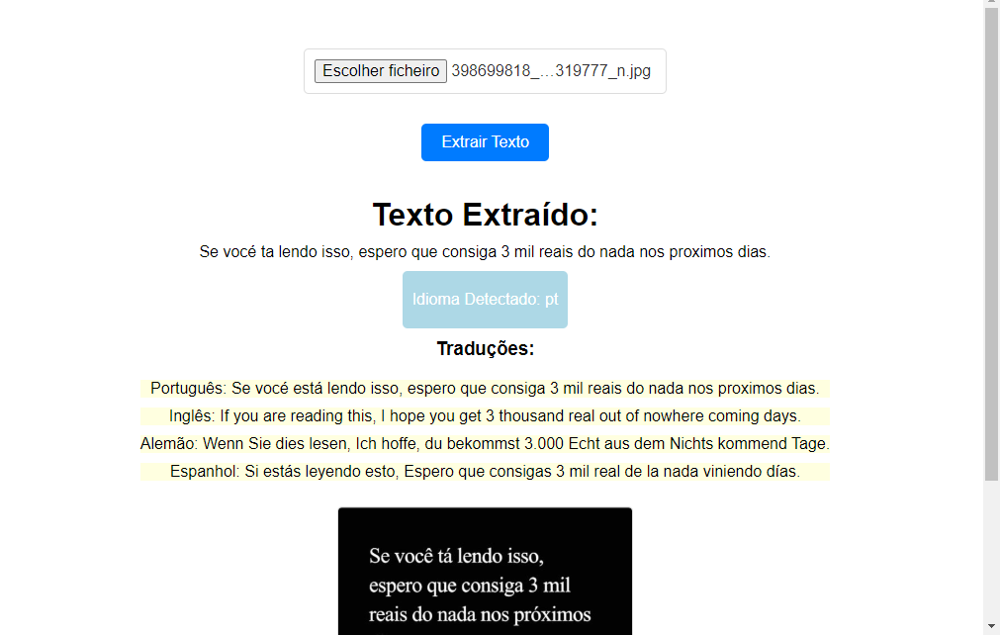

# Extrator e Tradutor de Texto em Imagens

## Descrição

O **Extrator e Tradutor de Texto em Imagens** é uma aplicação simples e eficaz que permite extrair texto de imagens e traduzi-lo para diferentes idiomas. Seja para converter documentos impressos em texto digital ou para entender rapidamente o conteúdo de imagens, esta aplicação oferece uma solução prática.

## Como Funciona

1. **Envio da Imagem:** Faça o upload da imagem contendo o texto que você deseja extrair e traduzir.


2. **Extração de Texto:** O aplicativo utiliza tecnologia OCR (Reconhecimento Óptico de Caracteres) para extrair o texto da imagem de forma precisa.


3. **Detecção de Idioma:** O idioma do texto extraído é automaticamente detectado para garantir uma tradução precisa.



7. **Tradução para Vários Idiomas:** O texto é traduzido para português, inglês, alemão e espanhol, proporcionando uma compreensão multilíngue do conteúdo.

8. **Resultados Claros:** Os resultados, incluindo o texto extraído, o idioma detectado e as traduções, são apresentados de maneira organizada para facilitar a compreensão.

## Tecnologias Utilizadas

- pytesseract 
- Googletrans 
- Flask
- win10toast
- langdetect

## Instalação

```
python -m venv venv
```
```
source venv/Scripts/activate
```
```
pip install -r req.txt
```
```
export FLASK_APP=app.py
```
```
flask run

```


## Como Usar

1. Faça o download do aplicativo.
2. Instale as dependências necessárias.
3. Inicie o aplicativo.
4. Abra o navegador e acesse a interface do usuário.
5. Faça o upload da imagem desejada.
6. Aguarde o processamento e visualize os resultados.

## Contribuição

Sua contribuição é bem-vinda! Sinta-se à vontade para propor melhorias, relatar problemas ou enviar solicitações de pull.

## Licença

Este projeto está sob a licença MIT.
